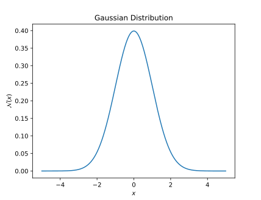

# Symbolic and Plotting Tools

We will consider symbolic math using `Mathematica`. Alternatives to `Mathematica` for symbolic mathematics include `Maple`, symbolic toolbox for `Matlab`, and the open source python package `sympy`.

## Symbolic Math using Mathematica
`Mathematica` is a popular tool for symbolic math, and is useful for many mathematical tasks such as calculating derivatives and integrals.

SUNY Plattsburgh students can install `Mathematica` on their personal computer. [See instructions here](https://www.plattsburgh.edu/academics/resources/technology/helpdesk/software.html).

### Performing mathematical calculations in Mathematica
Try typing `D[x^2, x]` and pressing ++shift+enter++ to evaluate the cell:

=== "Input"

    ``` mathematica
    D[x^2, x]
    ```

=== "Output"

    ``` mathematica
    2 x
    ```

The command `D[x^2, x]` calculates the derivative of $x^2$ with respect to $x$.

To calculate an integral, use the `Integrate` command as:

=== "Input"

    ``` mathematica
    Integrate[2 x, x]
    ```

=== "Output"
    ``` mathematica
    x^2
    ```

`Mathematica` can perform many popular integrals that show up in various topics of physics and mathematics. For example:  

Consider the Gaussian (normal) distribution with one standard deviation ($\sigma=1$) and zero mean $(\mu=0)$:

$$ \mathcal{N}(x) = \frac{1}{\sqrt{2 \pi}} e^{-{x^2}/{2}} $$

* Suppose we want to find the integral of this function from $-\infty$ to $\infty$. Such a definite integral will result in the area under the curve between the limits. Following the same syntax as above, using `Sqrt[2 Pi]` for $\sqrt{2 \pi}$ and using `Exp[-x^2]` for $e^{-x^2}$, attempt to calculate the definite integral:

    $$ \int_{-\infty}^\infty \frac{e^{-x^2/2}}{\sqrt{2 \pi}} dx $$

    ??? note "Check your `Mathematica` code and output"
    
        === "Input"
            
            ``` mathematica
            Integrate[(1/Sqrt[2 Pi]) Exp[-(x^2)/2], {x, -Infinity, Infinity}]
            ```
            
        === "Output"
        
            ``` mathematica
            1
            ```
        
        That is:
    
        $$\frac{1}{\sqrt{2 \pi}}\int_{-\infty}^\infty \frac{e^{-x^2/2}}{\sqrt{2 \pi}} dx =1$$

        The factor of $1/\sqrt{2 \pi}$ is used to normalize the distribution $P(x)$ so that it can be used as a probability density function (pdf). The integral of a pdf over all possible values should result in one.

* Now calculate another definite integral of the same integrand but taking the limits from $-1$ to $1$ i.e. calculate the definite integral:

    $$ \frac{1}{\sqrt{2\pi}}\int_{-1}^{1} e^{-x^2/2} dx $$

    ??? note "Check your `Mathematica` code and output"
    
        === "Input"
            
            ``` mathematica
            Integrate[(1/Sqrt[2 Pi]) Exp[-(x^2)/2], {x, -1, 1}]
            ```
            
        === "Output"
        
            ``` mathematica
            Erf[1/Sqrt[2]]
            ```
        
        where [`Erf` is the error function](https://mathworld.wolfram.com/Erf.html){target=_blank}. A numerical output in mathematica can be forced by either using `N[]` or `//N` as follows:
        
        === "Input"
        
            ``` mathematica
            N[Integrate[(1/Sqrt[2 Pi]) Exp[-(x^2)/2], {x, -1, 1}]]
            ```
            
        === "Output"
            
            ``` mathematica
            0.682689
            ```
        
        That is:
    
        $$\frac{1}{\sqrt{2 \pi}}\int_{-1}^1 e^{-x^2/2} dx = {\rm Erf}\left[\frac{1}{\sqrt{2}}\right] = 0.682689$$
        
* Using `Mathematica` now you should be able to obtain the following results:

$$ \int_{-1}^1 \frac{e^{-x^2/2}}{\sqrt{2\pi}} dx = 0.682689 $$

$$ \int_{-2}^2 \frac{e^{-x^2/2}}{\sqrt{2 \pi}} dx = 0.9545 $$  

$$ \int_{-3}^3 \frac{e^{-x^2/2}}{\sqrt{2\pi}} dx = 0.9973 $$  

Next we will learn some plotting syntax in `Mathematica` and use them to plot the integrand used above $\mathcal{N}(x)=e^{-x^2/2}/\sqrt{2 \pi}$ to better understand the normal probability density function.

## Plotting in Mathematica

=== "Input"
    
    ``` mathematica
    Plot[(1/Sqrt[2 Pi]) Exp[-(x^2)/2], {x, -5, 5}, AxesLabel -> {"x", "N(x)"}, PlotLabel -> "Gaussian Distribution"]
    ```   
=== "Output"

    <figure markdown>
        { align=left }
    </figure>


## Plotting in Matplotlib

`matplotlib` is a widely used python plotting library. It can be used in `google colab`, but you may need to install it ([see instructions](https://matplotlib.org/stable/users/installing/index.html)) if you have not already installed `matplotlib` on your computer.

The plot of the normal distribution $\mathcal{N}(x)$ can be made in `matplotlib` using the following code:

=== "Input"

    ``` py title="Making plot using matplotlib"
    import matplotlib.pyplot as plt         # (1)
    import numpy as np                      # (2)
    
    x = np.arange(-5, 5, 0.01)              # (3)
    y = np.exp(-x*x/2)/np.sqrt(2*np.pi)     # (4)
    
    plt.plot(x, y)                          # (5)
    plt.xlabel("$x$")                       # (6)
    plt.ylabel("$\mathcal{N}(x)$")          # (7)
    plt.title("Gaussian Distribution")      # (8)
    plt.show()                              # (9)
    ```
    
    1. import the `pyplot` plotting interface from `matplotlib` library as `plt`
    2. import the numerical python library `numpy` as `np` for various array and mathematical functions
    3. create an array from -5 to 5 in increments of 0.01; i.e. $\frac{5-(-5)}{0.01}=1000$ numbers in total. The number of items in the array `x` can be checked either using `len(x)` or using `np.size(x)`
    4. generate a numpy array for $y=\mathcal{N}(x)$
    5. make the plot using two arrays x and y
    6. add label on the x axis; the dollar signs means we use LaTex syntax for mathematical typesetting.
    7. add label on the y axis
    8. add plot title
    9. `plt.show()` may or may not be needed depending on the backend used for plotting; e.g. not needed in notebook interfaces such as jupyter/google colab.
    
=== "Output"

    <figure markdown>
        { align=left }
    </figure>

We can also plot vector fields using `matplotlib`. Let us plot the electric field due to a couple of simple charge configurations. Here we will use the `streamplot` function.

!!! example "Plotting a vector field"

    First think about what you need to do to make such a field plot given that you have a function in matplotlib that directly generates a field plot if you provide it with vector field values in a grid. In 2D you will need to provide the $x-$ component, $E_x$ and the $y-$component, $E_y$ of the electric field vector at each point. Recall:

    $$ \vec{E}(x,y) = \frac{k q}{r^2} \hat{r}  = \frac{k q}{r^3} \left( x \hat{i} + y \hat{j}\right)$$

    is the electric field at a point $(x,y)$ due to a charge $q$ at the origin, where $r=\sqrt{x^2+y^2}$.

    Similarly, if the point charge is located at $(x_0, y_0)$ rather than the origin:

    $$ \vec{E}(x,y) = \frac{k q}{r^3} \left[ (x-x_0)\hat{i}+(y-y_0)\hat{j}\right] $$

    where, $r = \sqrt{(x-x_0)^2 + (y-y_0)^2}$.

    Next, we need to understand the arguments of the `streamplot` function. In the documentation it is mentioned that at least four arguments are required:

    ```
    matplotlib.pyplot.streamplot(x, y, u, v)
    ```
    
    where `x` and `y` can be 1D arrays that form the grid of the vector plot, but `u` and `v` must be 2D arrays (like a matrix) providing the $x$ and $y$ components of the vector field at each point. 

    ``` title="pseudocode"
    1. q = 1 
    2. k = 1
    3. x, y = -5 to 5 with 0.1 stepsize
    3. U, V = 100x100 matrices with zeros
    4. iterate over x:
    5.   iterate over y:
    6.     rcube = sqrt(x*x+y*y)**3.0 
    7.     Ex = k * q * x / rcube
    8.     Ey = k * q * y / rcube
    9.     U[i,j] = Ex
    10.    V[i,j] = Ey
    11. streamplot(x, y, U, V)
    ```

??? question "Assignment: Implement a `streamplot` plot for the field due to two point charges separated by a distance."