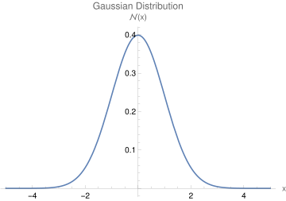

# Symbolic and Plotting Tools

## Symbolic Math using Mathematica
`Mathematica` is a popular tool for symbolic math, and is useful for calculating derivatives, integral, and many other tasks.

SUNY Plattsburgh students can installa `Mathematica` on their personal computer. [See instructions here](https://www.plattsburgh.edu/academics/resources/technology/helpdesk/software.html).

### Performing mathematical calculations in Mathematica
Try typing `D[x^2, x]` and pressing `Shift+Enter` to evaluate the cell:
``` mathematica

 In[1]:= D[x^2, x]
 Out[1]= 2 x
```
The command `D[x^2, x]` calculates the derivative of $x^2$ with respect to $x$.

To calculate an integral, use the `Integrate` command as:
``` mathematica
 In[2]:= Integrate[2 x, x]
 Out[2]= x^2
```

`Mathematica` can perform many popular integrals that show up in various topics of physics and mathematics. For example:  

Consider the Gaussian (normal) distribution with one standard deviation ($\sigma=1$) and zero mean $(\mu=0)$:

$$ P(x) = \frac{1}{\sqrt{\pi}} e^{-{x^2}/{2}} $$

Suppose we want to find the integral of this function from $-\infty$ to $\infty$. Such a definite integral will result in the area under the curve between the limits. Following the same syntax as above, using `Sqrt[2 Pi]` for $\sqrt{2 \pi}$ and using `Exp[-x^2]` for $e^{-x^2}$, attempt to calculate the definite integral:

$$ \frac{1}{\sqrt{2\pi}}\int_{-\infty}^\infty e^{-x^2/2} dx $$

??? note "Click here to check your `Mathematica` code and output"
    ``` mathematica
    In[3]:= Integrate[(1/Sqrt[Pi]) Exp[-(x^2)/2], {x, -Infinity, Infinity}]
    Out[3]=1
    ```
    That is:
    
    $$\frac{1}{\sqrt{2\pi}}\int_{-\infty}^\infty e^{-x^2/2} dx =1$$

    


## Plotting in Mathematica

``` mathematica
 In[4]:= Plot[(1/Sqrt[2 Pi]) Exp[-x^2], {x, -3, 3}, 
 AxesLabel -> {"x", "P(x)"}, PlotLabel -> "Gaussian Distribution"]
```

??? note "The output will be as follows"
    <figure markdown>
        
    </figure>


## Plotting in Matplotlib

## Example
